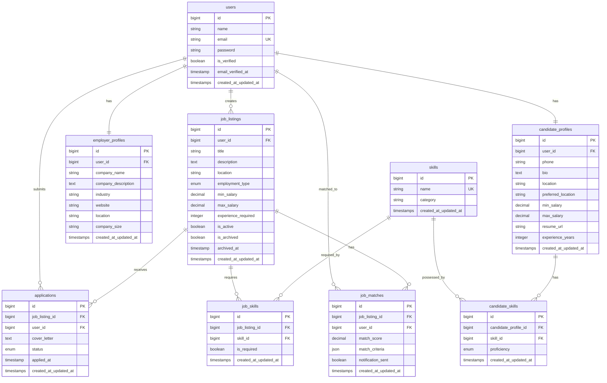
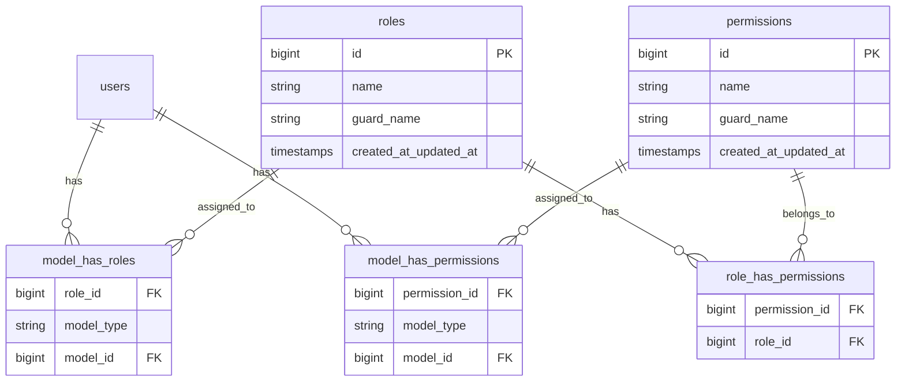

# HireSmart Database Entity Relationship Diagram

## Database Schema

```mermaid
erDiagram
    users ||--o{ job_listings : "creates"
    users ||--o{ applications : "submits"
    users ||--o{ job_matches : "matched_to"
    users ||--|| employer_profiles : "has"
    users ||--|| candidate_profiles : "has"

    job_listings ||--o{ applications : "receives"
    job_listings ||--o{ job_skills : "requires"
    job_listings ||--o{ job_matches : "has"

    skills ||--o{ job_skills : "required_by"
    skills ||--o{ candidate_skills : "possessed_by"

    candidate_profiles ||--o{ candidate_skills : "has"

    users {
        bigint id PK
        string name
        string email UK
        string password
        boolean is_verified
        timestamp email_verified_at
        timestamps created_at_updated_at
    }

    employer_profiles {
        bigint id PK
        bigint user_id FK
        string company_name
        text company_description
        string industry
        string website
        string location
        string company_size
        timestamps created_at_updated_at
    }

    candidate_profiles {
        bigint id PK
        bigint user_id FK
        string phone
        text bio
        string location
        string preferred_location
        decimal min_salary
        decimal max_salary
        string resume_url
        integer experience_years
        timestamps created_at_updated_at
    }

    job_listings {
        bigint id PK
        bigint user_id FK
        string title
        text description
        string location
        enum employment_type
        decimal min_salary
        decimal max_salary
        integer experience_required
        boolean is_active
        boolean is_archived
        timestamp archived_at
        timestamps created_at_updated_at
    }

    applications {
        bigint id PK
        bigint job_listing_id FK
        bigint user_id FK
        text cover_letter
        enum status
        timestamp applied_at
        timestamps created_at_updated_at
    }

    skills {
        bigint id PK
        string name UK
        string category
        timestamps created_at_updated_at
    }

    job_skills {
        bigint id PK
        bigint job_listing_id FK
        bigint skill_id FK
        boolean is_required
        timestamps created_at_updated_at
    }

    candidate_skills {
        bigint id PK
        bigint candidate_profile_id FK
        bigint skill_id FK
        enum proficiency
        timestamps created_at_updated_at
    }

    job_matches {
        bigint id PK
        bigint job_listing_id FK
        bigint user_id FK
        decimal match_score
        json match_criteria
        boolean notification_sent
        timestamps created_at_updated_at
    }
```

## Spatie Permission Tables

```mermaid
erDiagram
    users ||--o{ model_has_roles : "has"
    users ||--o{ model_has_permissions : "has"
    roles ||--o{ model_has_roles : "assigned_to"
    roles ||--o{ role_has_permissions : "has"
    permissions ||--o{ model_has_permissions : "assigned_to"
    permissions ||--o{ role_has_permissions : "belongs_to"

    roles {
        bigint id PK
        string name
        string guard_name
        timestamps created_at_updated_at
    }

    permissions {
        bigint id PK
        string name
        string guard_name
        timestamps created_at_updated_at
    }

    model_has_roles {
        bigint role_id FK
        string model_type
        bigint model_id FK
    }

    model_has_permissions {
        bigint permission_id FK
        string model_type
        bigint model_id FK
    }

    role_has_permissions {
        bigint permission_id FK
        bigint role_id FK
    }
```
